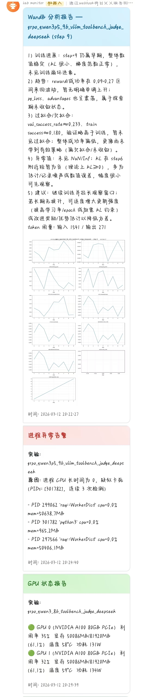

# Lab Monitor — 实验进展自动监控系统

基于飞书 Webhook 的深度学习实验全程监控工具，支持 GPU 状态追踪、进程健康检测（含分布式训练）、wandb 指标分析（大模型驱动），可同时监控多个实验。

---

## 效果预览



> 从上到下依次展示：WandB 分析报告（含指标曲线图）、进程异常告警、GPU 状态周期报告。

---

## 功能一览

| 功能 | 说明 |
|------|------|
| GPU 监控 | 定期采集利用率、显存、温度、功耗，超阈值即时告警 |
| 进程监控 | 检测训练进程消失、僵尸进程、CPU 停滞，支持 torchrun/deepspeed 分布式 |
| WandB 分析 | 轮询新 step，自动绘制指标曲线并调用大模型分析趋势/异常 |
| 飞书推送 | 分级推送：文本告警、富文本卡片、带图报告，内置限流防刷屏 |
| 多实验并发 | 每个实验独立调度，互不干扰 |

---

## 项目结构

```
lab_monitor/
├── main.py                        # 启动入口
├── config.yaml                    # 统一配置（需填写你的 key）
├── requirements.txt
└── lab_monitor/
    ├── config.py                  # 配置加载与数据类定义
    ├── scheduler.py               # APScheduler 调度核心
    ├── notifier/
    │   └── feishu.py              # 飞书 Webhook 推送
    ├── monitors/
    │   ├── gpu.py                 # pynvml GPU 采集
    │   ├── process.py             # psutil 进程健康检测
    │   └── wandb_monitor.py       # wandb API 轮询 + matplotlib 绘图
    └── analyzer/
        └── llm.py                 # OpenAI / Anthropic / ZhipuAI 分析封装
```

---

## 快速开始

### 1. 安装依赖

```bash
pip install -r requirements.txt
```

> 若不需要某个大模型，可省略对应包（`openai` / `anthropic` / `zhipuai`）。  
> 若服务器无 NVIDIA GPU，`pynvml` 安装后不会报错，但 GPU 监控将自动跳过。

### 2. 配置 `config.yaml`

```yaml
feishu:
  webhook_url: "https://open.feishu.cn/open-apis/bot/v2/hook/YOUR_TOKEN"

llm:
  provider: "openai"          # openai | anthropic | zhipu
  api_key: "sk-xxx"
  model: "gpt-4o"
  base_url: ""                # 可选：第三方代理地址

wandb:
  api_key: "YOUR_WANDB_KEY"
  entity: ""                  # 留空使用默认 entity

experiments:
  - name: "my_exp"
    wandb_project: "my-project"
    wandb_run_id: ""          # 留空自动选最新 running run
    process_keywords:
      - "train.py"
      - "torchrun"
    gpu_ids: [0, 1]
    gpu_alert_thresholds:
      memory_percent: 95      # 显存占用超过此值告警
      temperature: 85         # 温度超过此值告警
      utilization: 5          # 低于此值视为异常（训练中）

schedule:
  gpu_interval_seconds: 60
  process_interval_seconds: 30
  wandb_interval_seconds: 300   # wandb 轮询间隔
  wandb_step_check: true        # 检测到新 step 时立即分析
  alert_cooldown_minutes: 10    # 同类告警最小推送间隔
```

也可通过环境变量覆盖敏感信息：

```bash
export FEISHU_WEBHOOK_URL="https://..."
export LLM_API_KEY="sk-xxx"
export WANDB_API_KEY="xxx"
```

### 3. 启动监控

```bash
python main.py                      # 使用默认 config.yaml
python main.py -c /path/to/cfg.yaml # 指定配置文件
python main.py --log-level DEBUG    # 调试模式
```

按 `Ctrl+C` 优雅退出。

---

## 飞书机器人配置

1. 在飞书群组中添加「自定义机器人」
2. 开启「安全设置」（建议选「自定义关键词」或「IP 白名单」）
3. 将 Webhook URL 填入 `config.yaml`

> 飞书 Webhook 卡片暂不支持直接嵌入 base64 图片。当前方案：wandb 分析报告以富文本卡片发送分析文字，图表数据同步记录日志。如需在卡片中展示图表，可将 matplotlib 生成的图上传至可公网访问的图床，再通过飞书卡片 `img_key` 展示。

---

## 技术说明

### wandb 新 step 触发机制

wandb SDK 不提供 push 回调，本系统采用**轮询对比 `_step`** 的方式实现近实时触发。每隔 `wandb_interval_seconds` 秒检查一次，发现新 step 后立即调用 LLM 分析。间隔越小，反应越快，但 API 调用开销越大。

### 分布式训练进程识别

通过 `psutil` 扫描全局进程树，匹配 `process_keywords` 中的关键词。对于 `torchrun`/`deepspeed`/`accelerate` 等启动器，会自动递归收集所有子进程（即所有 rank），任意一个异常退出均会触发告警。

### 大模型图片分析

- **OpenAI / Anthropic**：支持将 matplotlib 生成的 PNG 图表以 base64 方式传入，模型直接分析曲线图
- **ZhipuAI GLM**：当前不支持图片输入，仅分析文字指标数据

---

## 扩展指南

- **新增大模型**：在 `lab_monitor/analyzer/llm.py` 中继承 `LLMAnalyzer`，实现 `analyze()` 方法，并在 `create_analyzer()` 工厂中注册
- **新增监控指标**：在对应 `monitors/*.py` 中扩展采集逻辑，在 `scheduler.py` 的对应 job 中处理告警
- **调整推送格式**：修改 `lab_monitor/notifier/feishu.py` 中的卡片构建方法
